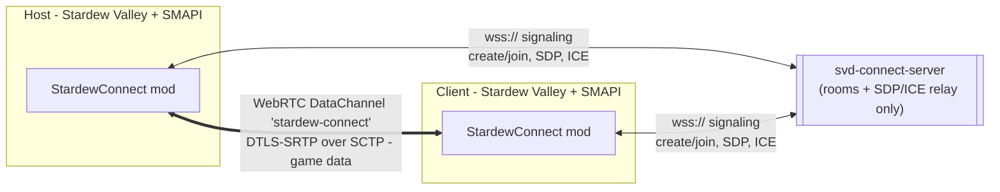
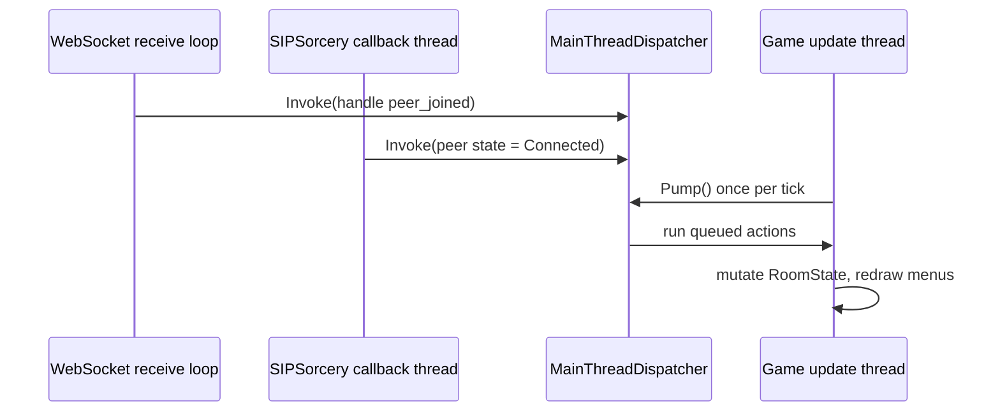
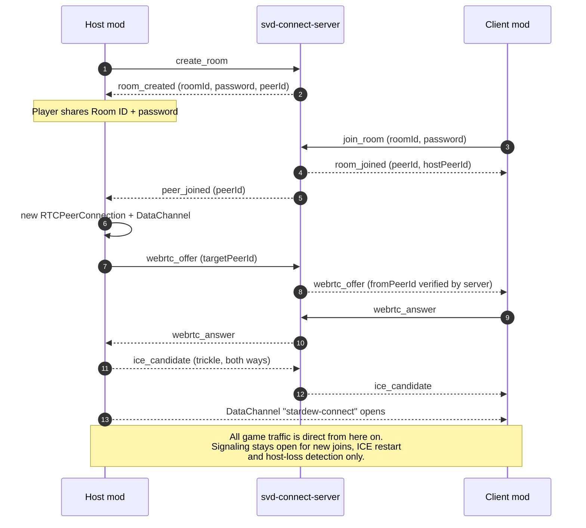
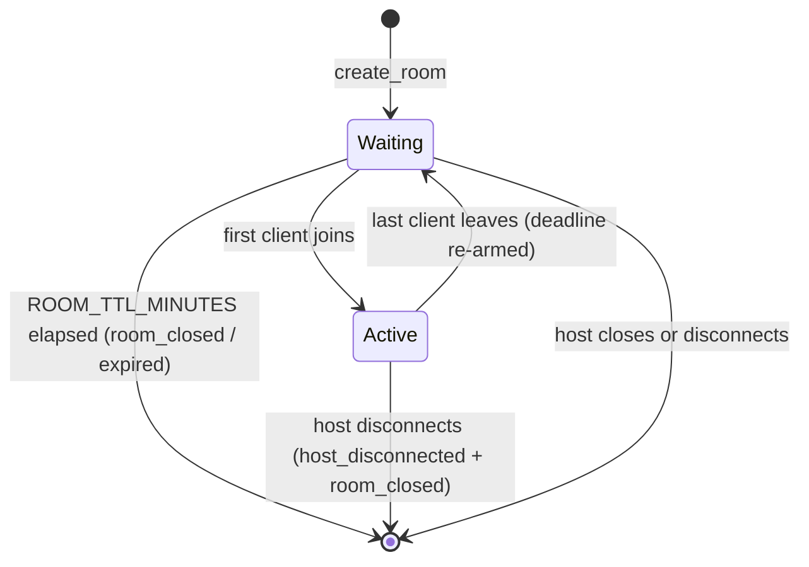

# Stardew Connect - Architecture

## The one rule

The signaling server exists **only** to introduce two peers to each other. Once the WebRTC
data channel is up, every byte of game traffic travels directly between host and client.
The server never sees, buffers or relays gameplay data.



## Components

### svd-connect-server (Node.js + TypeScript)

| Layer | File | Responsibility |
| --- | --- | --- |
| Entry | `src/index.ts` | Config load, logger, signal handling, graceful shutdown |
| Config | `src/config.ts` | Zod-validated environment, TLS material, derived limits |
| Transport | `src/websocket/WebSocketServer.ts` | HTTP (`/health`, `/metrics`) + WebSocket listener, origin allowlist, per-IP connection cap, heartbeat, cleanup timers |
| Connection | `src/websocket/ConnectionContext.ts` | Per-socket state. Holds the **server-assigned** `peerId`/`roomId` - the anchor for anti-spoofing |
| Routing | `src/websocket/MessageRouter.ts` | Validation, authorisation, room commands, relay |
| Rooms | `src/rooms/RoomManager.ts`, `Room.ts` | Room registry and lifecycle. Transport-agnostic: it never writes to a socket, it returns who should be notified |
| Ids | `src/rooms/RoomIdGenerator.ts` | `crypto.randomBytes` room ids, passwords, peer ids |
| Security | `src/security/PasswordService.ts`, `RateLimiter.ts` | scrypt hashing, sliding-window limits, lockouts |
| Observability | `src/utilities/logger.ts`, `metrics.ts` | Structured logs (never SDP bodies), Prometheus counters |

Room state lives in a `Map<string, Room>` in RAM. There is no database, and sockets are
never persisted anywhere.

### StardewConnect (C# / SMAPI mod)

```text
ModEntry ──> RoomSession ──> ISignalingClient ──> svd-connect-server
   │             │
   │             └────────> IWebRtcTransport ──> remote peer (DataChannel)
   │                              │
   │                              └──> NetworkMessageRouter ──> game payload handlers
   │
   ├──> MainThreadDispatcher   (network thread -> game thread)
   └──> UI menus               (read-only view of RoomState)
```

| Namespace | Type | Responsibility |
| --- | --- | --- |
| `Configuration` | `ModConfig` | `config.json`, including the signaling URL and ICE servers |
| `Protocol` | `ClientMessages`, `ServerMessages`, `MessageTypes` | Wire types, `System.Text.Json` only |
| `Networking` | `ISignalingClient` / `SignalingClient` | `ClientWebSocket`, frame reassembly, `requestId` correlation, heartbeat, reconnect with exponential backoff |
| `Networking` | `IWebRtcTransport` | The swappable peer-to-peer abstraction |
| `Networking` | `WebRtcTransport` | SIPSorcery: one `RTCPeerConnection` per peer, one data channel `stardew-connect` |
| `Networking` | `MockWebRtcTransport` | Runs the full signaling choreography with synthetic SDP/ICE, for debugging without a working ICE path |
| `Networking` | `NetworkMessageRouter` | Multiplexes the data channel into channels; channel 0 is control (keepalive/RTT) |
| `Rooms` | `RoomSession`, `RoomState` | Orchestration and the single source of UI truth |
| `UI` | `StardewConnectMenu`, `HostRoomMenu`, `JoinRoomMenu` | Vanilla-styled menus |
| `Utilities` | `MainThreadDispatcher`, `ClipboardHelper`, `Translations` | Thread marshalling, clipboard, i18n |

## Threading model

Stardew Valley is not thread safe, so the mod has exactly one rule:

> Network callbacks may **not** touch game state. They hand work to `MainThreadDispatcher`,
> which `ModEntry` drains once per `UpdateTicked`.



`RoomState` is therefore only ever read and written on the update thread, which is why the
menus can read it every frame without locking.

## Connection flow



## Room lifecycle



A room never exists without a host. When the host's socket drops, every client is told and
the room is destroyed immediately.

## Extension points

The seams that were designed in deliberately:

| Future feature | Where it plugs in |
| --- | --- |
| TURN / short-lived TURN credentials | `ModConfig.IceServers`; fetch credentials at runtime instead of storing them |
| Alternative transport (TCP, KCP, ENet) | Implement `IWebRtcTransport`; nothing else changes |
| Redis pub/sub for multiple server instances | Replace the maps inside `RoomManager` and `RateLimiter` |
| Matchmaking, friends list | New message types in `protocol/schemas.ts` + `Protocol/*.cs` |
| Host migration | `RoomManager` already separates "room" from "host peer" |
| Mod compatibility handshake, version checks | `NetworkMessageRouter` control channel (0) |
| Gameplay sync | Register a handler on `NetworkMessageRouter.GameChannel` |
